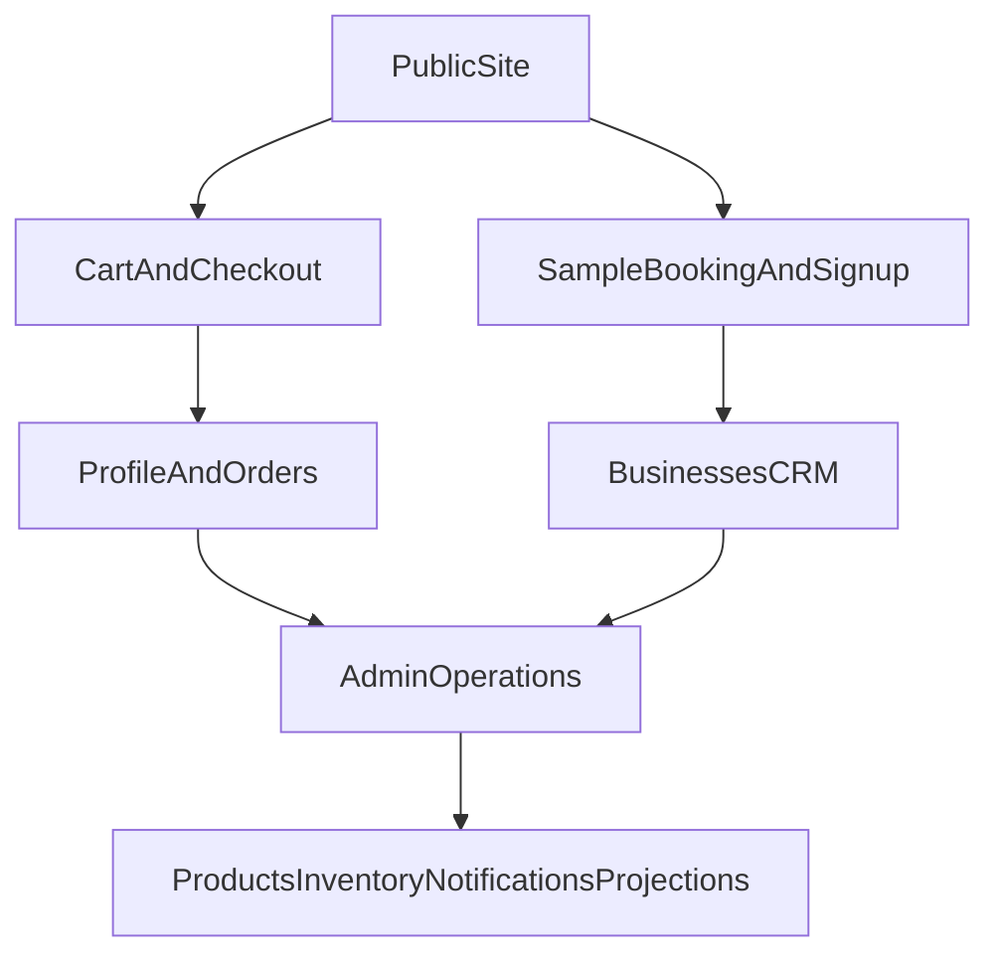

# Vento Caffe Platform PRD

## Purpose
This document is a living product requirements document for the Vento Caffe platform. It has two jobs:

1. Capture what the platform does today.
2. Track the most important features and improvements to build next.

## Product Summary
Vento Caffe is a multilingual coffee subscription and ordering platform for both business and home customers. The core offer is simple: premium coffee cialde delivered monthly, with a free espresso machine included when customers commit to recurring orders.

The platform is not only a storefront. It also includes an internal admin and CRM layer for managing orders, products, business leads, sample bookings, agents, inventory-related workflows, notifications, and growth projections.

## Primary Users
### External Users
- Small businesses such as hotels, Airbnbs, offices, salons, spas, clinics, restaurants, gyms, studios, and coworking spaces.
- Home customers who want easy recurring espresso delivery.

### Internal Users
- Admins managing orders, products, leads, stock, and operations.
- Sales or field agents assigned to business accounts.

## Product Goals
### Customer Goals
- Make premium espresso easy to start and easy to repeat.
- Remove upfront machine cost.
- Support low-friction ordering via web and WhatsApp.
- Give customers a basic account area to manage profile and orders.

### Business Goals
- Convert traffic into recurring coffee customers.
- Use free sample bookings and signups as lead generation channels.
- Centralize operations in one admin workflow.
- Improve retention, operational visibility, and revenue predictability.

## Current Platform Analysis
### 1. Customer Experience
Current strengths:
- Localized marketing pages and product messaging are already structured for multiple languages.
- The homepage clearly communicates the main offer: premium cialde, free machine, monthly convenience.
- The shop supports both single products and business package tiers.
- The profile area gives authenticated users access to their account and order history.

Current gaps:
- The value proposition mixes B2C and B2B audiences on the same journey, which may reduce clarity.
- There is no dedicated onboarding flow for business customers beyond sample booking and package browsing.
- Trust-building content exists, but there is room for stronger FAQ, proof, testimonials, and comparison content.

### 2. Commerce And Subscription Flow
Current strengths:
- Customers can browse products, add items to cart, authenticate, and create orders.
- Checkout collects shipping details and supports subscription-flagged orders.
- Orders appear in the profile area and in admin workflows.
- Product publishing and display order already exist in the data model.

Current gaps:
- Checkout currently creates orders directly without a visible payment step or payment provider workflow.
- The platform marks orders as subscription-related, but there is no complete subscription management center for renewals, pauses, billing cadence, or machine eligibility lifecycle.
- Customer communications after purchase appear limited.
- There is no explicit self-serve reorder shortcut or order recommendation loop beyond the current cart flow and WhatsApp messaging.

### 3. Lead Generation And CRM
Current strengths:
- Visitors can book a free sample from the homepage.
- Sample bookings are stored in the database and exposed to admins.
- New user signups can automatically create linked business records and admin notifications.
- Businesses, business activities, and agents are already modeled in the CRM layer.

Current gaps:
- The sample booking UI collects less information than the backend supports and does not capture richer qualification data.
- Lead scoring, reminders, ownership workflows, and conversion automation appear lightweight.
- There is no clear lifecycle reporting from lead to sample to customer.
- CRM activity history likely depends on manual admin discipline rather than system-generated milestones.

### 4. Admin Operations
Current strengths:
- Admin navigation already covers dashboard, notifications, orders, products, businesses, agents, sample bookings, and projections.
- Admin server actions cover a broad operational surface: order management, client lookup, business management, agent assignment, sample booking conversion, product management, stock movements, and pricing updates.
- Notifications for new orders and new business signups already exist.
- Projections provide a lightweight planning model for growth and investment allocation.

Current gaps:
- Operational analytics appear stronger for projections than for real product and funnel performance.
- The admin dashboard exists, but its top-level KPI definitions are not clearly specified, which makes it harder to trust the stats and use them for daily decisions.
- The admin surface may become crowded as workflows grow, especially without role-specific views.
- There is no obvious task management, SLA tracking, or workflow inbox for lead follow-up and fulfillment.
- Inventory operations exist, but proactive alerts and replenishment planning could be stronger.

## Core Platform Flows

### Flow 1: Business Lead Capture
1. A visitor lands on the site and books a free sample.
2. The booking is stored in `sample_bookings`.
3. Admins review bookings and can convert them into businesses.
4. Business records can then be enriched, assigned to agents, and moved through the pipeline.

### Flow 2: Customer Order Flow
1. A visitor browses products or package tiers.
2. The visitor adds items to cart and proceeds to checkout.
3. Authenticated users submit shipping details and create an order.
4. Orders become visible in both the customer profile and admin tools.

### Flow 3: Signup To CRM
1. A user account is created.
2. A linked profile is created.
3. A linked business lead can be auto-created from signup.
4. Admin notifications alert the team to new business signups.

## Key Product Risks And Gaps
These are the most important product-level issues inferred from the current implementation:

- The storefront is more mature than the subscription lifecycle. The main promise is recurring delivery, but subscription management is not yet a first-class customer feature.
- Lead generation is present, but qualification and conversion workflows are still early-stage.
- Operations are centralized in admin, but analytics and prioritization workflows appear limited.
- The repository documentation is behind the real product. The current `README.md` still describes an earlier marketing/e-commerce version and does not reflect the live admin/CRM scope.

## Current Opportunities
### Quick Wins
- Add richer qualification fields to sample booking.
- Add FAQ and trust-building content focused on the free-machine offer.
- Add order confirmation and delivery communication touchpoints.
- Refresh documentation so product, engineering, and operations share the same platform picture.

### High-Impact Product Improvements
- Build a true subscription management experience.
- Introduce payment and billing clarity in checkout.
- Create a clearer business-customer acquisition path from landing page to sample to conversion.
- Improve reorder and retention loops for existing customers.

### Operational Improvements
- Add lead pipeline reporting and follow-up workflows.
- Add low-stock and operational alerts.
- Create role-aware admin experiences for admins vs agents.
- Improve lifecycle automation from sample booking to active account.

### Growth And Analytics
- Add funnel analytics for homepage, sample booking, signup, checkout, and reorder.
- Track source attribution and conversion by customer type.
- Connect projections to actual operational metrics over time.

### Admin Dashboard KPI Definition
- The admin dashboard should prioritize operational KPIs that help the team understand current business activity at a glance, not mix operational metrics with funnel analytics and long-range projections.
- The default top-level KPI set should center on total non-cancelled orders, total revenue, active accounts, and subscription orders.
- Revenue should use the effective order total, including overrides when they exist.
- Dashboard cards and order/revenue charts should apply the same cancellation rules and date-window logic so totals stay internally consistent.
- Active account counting should treat a linked business and linked profile as one account when that relationship is known.
- CRM funnel reporting, attribution, and lifecycle conversion should remain separate reporting surfaces, even if linked from the dashboard later.

## Prioritized Feature And Improvement Tracker
Use the table below as the living backlog. Update `Status`, `Owner`, `Priority`, and `Notes` as work progresses.

| ID | Area | Problem | Proposed Improvement | Priority | Status | Impact | Effort | Owner | Notes |
| --- | --- | --- | --- | --- | --- | --- | --- | --- | --- |
| CX-01 | Customer Experience | Homepage messaging serves both home and business audiences in one path. | Create clearer audience paths for business vs home customers, starting from the homepage and CTA structure. | High | Proposed | High | Medium | Unassigned | Could improve conversion quality. |
| CX-02 | Customer Experience | Trust content is light for a premium recurring offer. | Add FAQ, social proof, machine-offer explanation, and objection-handling content. | Medium | Proposed | Medium | Low | Unassigned | Good quick win for conversion. |
| COM-01 | Commerce | Checkout creates orders without a visible payment workflow. | Define and implement payment method strategy with clearer checkout states and confirmation handling. | High | Proposed | High | High | Unassigned | Important before scaling paid traffic. |
| COM-02 | Subscription | Subscription is a core promise but not a fully managed customer experience. | Build subscription management for renewals, pause/resume, cadence, and plan visibility in profile. | High | Proposed | High | High | Unassigned | Core product maturity gap. |
| COM-03 | Post-Purchase | Customer follow-up after order appears limited. | Add automated order confirmation, status updates, and reorder nudges. | High | Proposed | Medium | Medium | Unassigned | Can combine email and WhatsApp. |
| COM-04 | Retention | Reordering is possible but not optimized. | Add one-click reorder, recommended refill timing, and saved preferences. | Medium | Proposed | Medium | Medium | Unassigned | Useful for repeat purchase behavior. |
| CRM-01 | Lead Gen | Sample booking captures only basic information. | Add email, business size, expected monthly usage, preferred contact method, and notes to the booking form. | High | Proposed | High | Low | Unassigned | Backend already supports some extra fields like email. |
| CRM-02 | CRM | Lead follow-up appears manual and lightly structured. | Add lead ownership, reminders, follow-up tasks, and next-step tracking for businesses. | High | Proposed | High | Medium | Unassigned | Strong operational leverage. |
| CRM-03 | CRM Analytics | No clear lifecycle visibility from sample to conversion. | Add funnel reporting for bookings, signups, converted businesses, and first orders. | High | Proposed | High | Medium | Unassigned | Helps prioritize sales effort. |
| OPS-01 | Admin Operations | Admin scope is broad but not obviously role-aware. | Add role-based views and permissions for admins, operators, and agents. | Medium | Proposed | Medium | Medium | Unassigned | Reduces clutter and risk. |
| OPS-02 | Inventory | Inventory workflows exist, but proactive alerting is unclear. | Add low-stock alerts, reorder thresholds, and replenishment suggestions. | High | Proposed | High | Medium | Unassigned | Supports service reliability. |
| OPS-03 | Operations | There is no central workflow inbox for what to do next. | Add operational task views for new orders, pending bookings, overdue follow-ups, and unread notifications. | Medium | Proposed | High | Medium | Unassigned | Useful for daily team execution. |
| DATA-01 | Analytics | Projection tools exist, but actual product analytics appear limited. | Build a metrics dashboard for traffic, conversion, AOV, repeat order rate, and lead-to-customer conversion. | High | Proposed | High | Medium | Unassigned | Needed for product decisions. |
| DATA-02 | Attribution | Marketing source visibility is not clear in current flows. | Track acquisition source across sample bookings, signups, and orders. | Medium | Proposed | Medium | Medium | Unassigned | Important for growth spend. |
| DATA-03 | Analytics | Admin dashboard stats are not yet clearly defined and can be misleading or inconsistent. | Define the admin dashboard KPI model, align labels with the real query logic, and standardize rules for cancellations, revenue totals, date ranges, and active account counting. | High | Proposed | High | Low | Unassigned | Improves trust in daily operational reporting. |
| DOC-01 | Documentation | Repository docs are outdated relative to platform scope. | Update the project documentation to reflect commerce, CRM, admin, and Supabase-backed workflows. | Medium | Proposed | Medium | Low | Unassigned | Helps alignment and onboarding. |

## Suggested Roadmap Buckets
### Phase 1: Foundation And Quick Wins
- `DOC-01` Update project documentation.
- `CX-02` Strengthen trust and FAQ content.
- `CRM-01` Improve sample booking qualification.
- `COM-03` Add post-order communications.
- `DATA-03` Define trustworthy admin dashboard KPIs.

### Phase 2: Conversion And Retention
- `CX-01` Separate business and home acquisition paths.
- `COM-01` Clarify payment and checkout flow.
- `COM-04` Improve reorder experience.
- `CRM-03` Add lead-to-order funnel reporting.

### Phase 3: Operational Scale
- `COM-02` Build full subscription management.
- `CRM-02` Add structured lead follow-up workflows.
- `OPS-02` Add inventory alerts and planning support.
- `OPS-03` Add an operational workflow inbox.
- `DATA-01` Add real business metrics dashboarding.

## Source Of Truth In The Repository
Use these files as anchors when updating this PRD:

- `PRODUCT.md` for product positioning and audience.
- `src/data/content.ts` and `src/messages/en.json` for customer-facing content structure.
- `src/app/[locale]/shop/page.tsx`, `src/app/[locale]/checkout/page.tsx`, and `src/app/[locale]/profile/page.tsx` for customer journeys.
- `src/components/home/SampleBookingForm.tsx` and `src/lib/actions/bookSample.ts` for lead generation.
- `src/components/admin/AdminSidebar.tsx`, `src/components/admin/DashboardChart.tsx`, `src/app/[locale]/admin/page.tsx`, and `src/lib/actions/admin.ts` for internal scope and dashboard KPI logic.
- `supabase/migrations/004_sample_bookings.sql`, `007_businesses.sql`, `008_agents.sql`, `016_auto_business_and_admin_notifications.sql`, and `017_product_publish_and_ordering.sql` for the platform data model and feature history.

## How To Maintain This Document
When a new feature or improvement is identified:

1. Add it to the tracker with a new ID.
2. Assign one primary area: `Customer Experience`, `Commerce`, `Subscription`, `Lead Gen`, `CRM`, `Operations`, `Analytics`, or `Documentation`.
3. Keep the problem statement short and user- or business-centered.
4. Update `Status` as it moves from `Proposed` to `Planned`, `In Progress`, `Shipped`, or `Cancelled`.
5. Move shipped items into a changelog section later if this file becomes too large.

## Status Legend
- `Proposed`: identified but not yet scheduled.
- `Planned`: approved and queued.
- `In Progress`: actively being worked on.
- `Shipped`: live in production.
- `Cancelled`: intentionally dropped.
