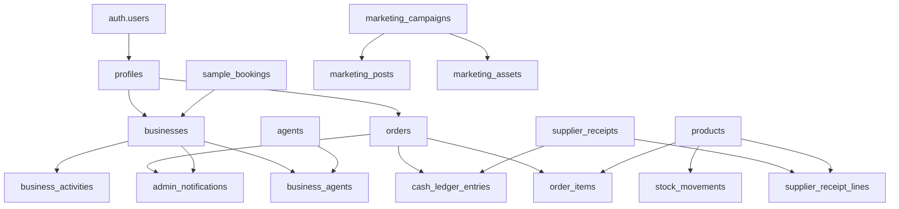
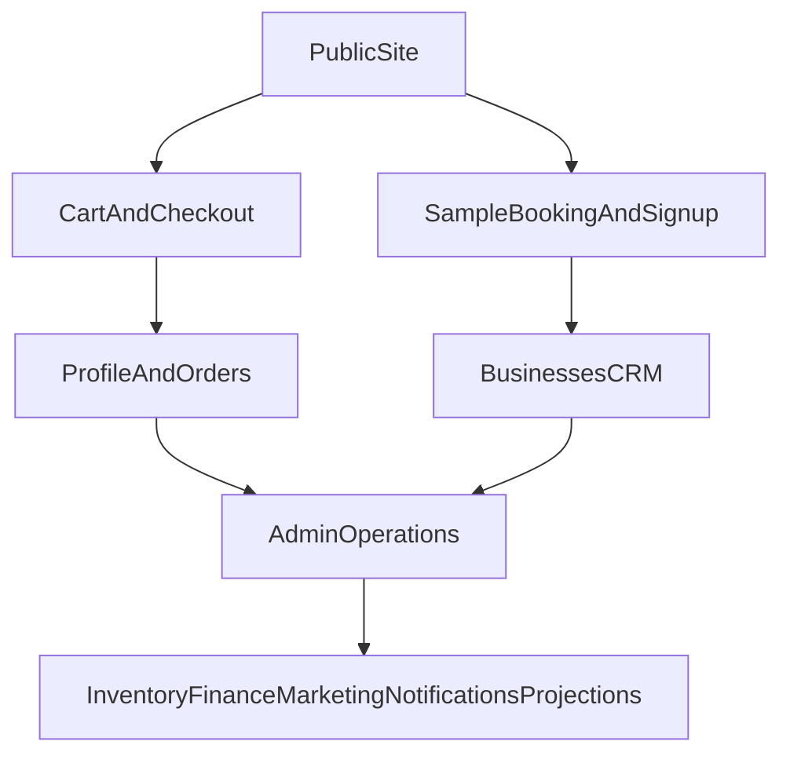

# Vento Caffe Platform PRD

## Purpose
This is a living product requirements document for the Vento Caffe platform. It has two jobs:

1. Capture what the platform actually does today, accurately enough to build on.
2. Track the most important features and improvements to build next.

This document was rewritten directly against the codebase (routes, server actions, and Supabase migrations `001`-`022`) so it reflects the real implementation, not an idealized version.

## Product Summary
Vento Caffe is a multilingual coffee subscription and ordering platform for both business and home customers in Albania. The core offer is simple: premium coffee cialde (pods) delivered monthly, with a free professional espresso machine included when customers commit to recurring orders. Ordering is low-friction via web and WhatsApp. Prices are in Albanian Lekë (integer LEK).

The platform is far more than a storefront. It also includes a substantial internal back office: an admin dashboard, B2B CRM with a sales pipeline and agents, order and inventory management, a finance suite (revenue vs cost-of-goods vs supplier receipts and a cash ledger), AI-assisted supplier-receipt OCR, an AI marketing studio, an admin notification inbox, a follow-up calendar, and a projections/forecasting model.

See [PRODUCT.md](PRODUCT.md) for the narrative product positioning.

## Primary Users
### External Users
- Small businesses: hotels, Airbnbs, offices, salons, spas, clinics, restaurants, cafes, gyms, studios, coworking spaces.
- Home customers who want easy recurring espresso delivery.

### Internal Users
- Admins managing dashboard, orders, products, inventory, leads, finance, marketing, and operations.
- Sales / field agents assigned to business accounts.

Internal access is role-gated: a user is an admin only if `profiles.role === "admin"`. Authorization is enforced both at the route layer ([src/app/[locale]/admin/layout.tsx](src/app/[locale]/admin/layout.tsx)) and inside every privileged server action via `verifyAdmin()` in [src/lib/actions/admin.ts](src/lib/actions/admin.ts).

## Product Goals
### Customer Goals
- Make premium espresso easy to start and easy to repeat.
- Remove the upfront machine cost.
- Support low-friction ordering via web and WhatsApp.
- Give customers an account area to manage profile, addresses, and order history.

### Business Goals
- Convert traffic into recurring coffee customers.
- Use free sample bookings and signups as lead-generation channels.
- Centralize sales, fulfillment, inventory, and finance in one admin workflow.
- Improve retention, operational visibility, and revenue predictability.

## Tech Stack And Architecture
- **Framework**: Next.js 16 (App Router, React 19) with server components and `"use server"` server actions. Middleware lives in [src/proxy.ts](src/proxy.ts) (Next 16 renamed `middleware` to `proxy`).
- **Data + Auth + Storage**: Supabase (Postgres with Row Level Security, Supabase Auth via `@supabase/ssr` cookie sessions, and Storage buckets `product-images`, `marketing-assets`, `supplier-receipts`).
- **Internationalization**: `next-intl` v4. Locales are `sq`, `it`, `en` with default `sq` (Albanian) and `localePrefix: "always"`, configured in [src/i18n/config.ts](src/i18n/config.ts). Message catalogs live in [src/messages/](src/messages).
- **Email**: Resend (order confirmation and status-update emails) in [src/lib/email.ts](src/lib/email.ts).
- **AI**: OpenAI. `gpt-4.1-mini` for marketing copy, `gpt-image-1` for marketing images, and `gpt-4o-mini` (default, overridable) for supplier-receipt OCR.
- **Media + Charts**: Remotion / `@remotion/player` for the product showcase video; `recharts` for admin charts.
- **Styling**: Tailwind CSS v4.
- **Payments**: none integrated yet. Checkout creates orders directly without a payment provider.

### Authentication Model
- Sessions are Supabase Auth cookies, refreshed in middleware ([src/lib/supabase/middleware.ts](src/lib/supabase/middleware.ts) via `updateSession`).
- Login/signup/logout/password reset are handled client-side through a modal (`AuthModal` / `AuthProvider` in `@/components/auth`); there are no dedicated `/login` or `/signup` routes.
- OAuth / magic-link code exchange happens at the only API route, `GET` [src/app/auth/callback/route.ts](src/app/auth/callback/route.ts).
- Per-request, storefront actions call `supabase.auth.getUser()` and scope queries by `user_id`; RLS provides defense in depth.

## Current Capabilities
This section is the heart of the document: it describes what is built and live today.

### 1. Storefront And Content
- **Homepage** ([src/app/[locale]/page.tsx](src/app/[locale]/page.tsx)): hero with embedded free-sample booking form, trust badges, featured product preview, business-packages preview, "how it works", product showcase (Remotion video), testimonials, and FAQ. Pulls data via `getFeaturedProducts` and `getCialdeProducts`.
- **Shop** ([src/app/[locale]/shop/page.tsx](src/app/[locale]/shop/page.tsx)): grid of cialde products plus the espresso machine, and a "Business Packages" section. Business package tiers are static in [src/lib/data/businessPackages.ts](src/lib/data/businessPackages.ts) (1-10 boxes, per-box price 5000-5500 LEK with volume discounts).
- **Product detail** ([src/app/[locale]/shop/[slug]/page.tsx](src/app/[locale]/shop/[slug]/page.tsx)): gallery, price, add-to-cart, subscription option, related products, trust badges. Uses `generateStaticParams` over product slugs x locales.
- **Marketing/legal**: `about`, plus `legal/shipping`, `legal/privacy`, `legal/terms`. All i18n text.
- **Newsletter**: footer signup via `subscribeToNewsletter` / `unsubscribeFromNewsletter` in [src/lib/actions/newsletter.ts](src/lib/actions/newsletter.ts), stored in `newsletter_subscribers`.
- **WhatsApp**: deep links (`wa.me/355689188161`) throughout the storefront and emails; no WhatsApp API integration.

### 2. Customer Accounts
- **Profile** ([src/app/[locale]/profile/page.tsx](src/app/[locale]/profile/page.tsx)): authenticated account area (redirects unauthenticated users home). Tabs for profile details and order history.
- Actions in [src/lib/actions/profile.ts](src/lib/actions/profile.ts): `getProfile`, `updateProfile` (name, phone, default shipping address; mirrors name into auth metadata), `updatePassword`.
- Order history and `cancelOrder` (pending orders only) via [src/lib/actions/orders.ts](src/lib/actions/orders.ts).

### 3. Cart, Checkout And Orders
- **Cart**: client cart context ([src/lib/cart.tsx](src/lib/cart.tsx)) optionally persisted server-side per user via [src/lib/actions/cart.ts](src/lib/actions/cart.ts) (`saveCart`, `loadCart`, `clearServerCart`) into the `carts` table. Carries an `is_subscription` flag.
- **Checkout** ([src/app/[locale]/checkout/page.tsx](src/app/[locale]/checkout/page.tsx)): handles loading / empty / not-logged-in (opens auth modal) / form / success states. Shipping form prefilled from profile; order summary applies free-machine and subscription logic.
- **Order creation** (`createOrder` in [src/lib/actions/orders.ts](src/lib/actions/orders.ts)): resolves product slugs to ids, inserts an `orders` row (status `pending`), inserts `order_items`, rolls back on failure, and sends a confirmation email via Resend. Customer order reads are `getOrders` / `getOrderById`.
- **Subscription handling today** is a boolean flag (`orders.is_subscription`, `carts.is_subscription`) only. There is no recurring-billing engine, renewal scheduler, or pause/resume.

### 4. Lead Generation (Sample Bookings)
- Public "try it free" form (`bookSample` in [src/lib/actions/bookSample.ts](src/lib/actions/bookSample.ts)) requires no auth and enforces a booking date of at least tomorrow.
- Captures name, phone, optional email, business type, address, city, booking date, notes, plus qualification fields: `business_size`, `estimated_monthly_usage`, `preferred_contact_method` (migration `019`).
- Stored in `sample_bookings` (status `pending`). Admins manage these and can convert them into businesses.

### 5. B2B CRM (Businesses And Agents)
- **Businesses pipeline** ([src/app/[locale]/admin/businesses/page.tsx](src/app/[locale]/admin/businesses/page.tsx)): filterable, paginated list with stats; detail page has a pipeline-stage stepper, linked profile/booking, assigned agents, an activity timeline, and order history with a new-order form.
- CRM actions in [src/lib/actions/admin.ts](src/lib/actions/admin.ts): `getAdminBusinesses`, `getAdminBusinessStats`, `getAdminBusinessById`, `createBusiness`, `updateBusiness`, `updateBusinessStage`, `deleteBusiness`, `addBusinessActivity`.
- **Agents** (internal team): `getAgents`, `getAgentById`, `createAgent`, `updateAgent`, `deleteAgent`; many-to-many assignment via `business_agents` (`assignAgentToBusiness`, `unassignAgentFromBusiness`, `getBusinessAgents`, `getAgentBusinesses`).
- **Auto-business on signup**: the `handle_new_user()` trigger creates a `businesses` row (`source = "signup"`) linked to the new profile (migration `016`).
- **Lead conversion**: `convertSampleBookingToBusiness`, plus `getUnlinkedProfiles` / `getUnlinkedSampleBookings` and auto-link helpers tie standalone leads to businesses.

### 6. Admin Order Management
- **Orders list** ([src/app/[locale]/admin/orders/page.tsx](src/app/[locale]/admin/orders/page.tsx)): status-filtered, searchable, paginated.
- **Order detail** ([src/app/[locale]/admin/orders/[id]/page.tsx](src/app/[locale]/admin/orders/[id]/page.tsx)): editable items, editable order date, status control, client/business info, shipping address.
- Actions: `getAdminOrders`, `getAdminOrderById`, `updateOrderStatus` (validates enum; emails the customer on notifiable statuses), `updateOrderDate`, `saveOrderItems` (adjusts stock via `stock_movements`), and `createAdminOrder` (admin order tied to a business).

### 7. Products And Inventory
- **Products admin** ([src/app/[locale]/admin/products/page.tsx](src/app/[locale]/admin/products/page.tsx)): low-stock alerts, stat cards, list; create/edit pages with image upload and stock management.
- Actions: `getAdminProducts`, `getAdminProductById`, `createProduct`, `updateProduct`, `deleteProduct`, `uploadProductImage` / `deleteProductImage` (Storage bucket `product-images`).
- **Inventory**: `addStockMovement` (`purchase | sale | adjustment | return`) recomputes `products.stock_quantity` (guards against negative stock) with a full audit trail in `stock_movements`; `getStockMovements` lists history. `updateProductPricing` manages `price`, `cost_price`, and `low_stock_threshold`.
- **Lifecycle automation**: products have `status` (`draft | published`) and `display_order` (migration `017`); a trigger auto-sets `sold_out` when stock hits 0 (migration `013`).
- Catalog read layer for the storefront is [src/lib/data/products.ts](src/lib/data/products.ts).

### 8. Finance
- **Finance dashboard** ([src/app/[locale]/admin/finance/page.tsx](src/app/[locale]/admin/finance/page.tsx)): revenue vs estimated COGS vs reviewed supplier receipts, net-after-receipts, a 12-month chart, top-products-by-profit, and data-quality alerts. Powered by `getFinanceDashboard` in [src/lib/actions/admin.ts](src/lib/actions/admin.ts). COGS is estimated from `order_items` and `products.cost_price`; pricing/margin helpers live in [src/lib/utils/pricing.ts](src/lib/utils/pricing.ts).
- **Cash ledger** ([src/lib/actions/cash-ledger.ts](src/lib/actions/cash-ledger.ts)): records cash in/out (`order_payment`, `supplier_payment`, `manual_adjustment`, `opening_balance`) into `cash_ledger_entries`, with balance/this-month aggregates and receipt-coverage cross-checks. Entries can link to orders and supplier receipts.

### 9. AI Features
- **Supplier receipts (OCR)** ([src/lib/actions/receipts.ts](src/lib/actions/receipts.ts), UI [src/app/[locale]/admin/receipts/page.tsx](src/app/[locale]/admin/receipts/page.tsx)): admins upload supplier invoice photos; OpenAI vision (`gpt-4o-mini`, overridable via `OPENAI_RECEIPT_MODEL`) extracts totals and line items and suggests catalog matches by product UUID. Humans review/confirm matches; status flows `draft -> reviewed -> archived`. Reviewed totals feed the finance dashboard. Stored in `supplier_receipts` / `supplier_receipt_lines` (private `supplier-receipts` bucket).
- **Marketing studio** ([src/lib/actions/marketing.ts](src/lib/actions/marketing.ts), UI [src/app/[locale]/admin/marketing/page.tsx](src/app/[locale]/admin/marketing/page.tsx)): generates Albanian Instagram/Facebook/TikTok captions, hashtags, and image prompts with `gpt-4.1-mini`; generates/edits social images from reference assets with `gpt-image-1`; manages drafts, scheduled posts, an asset library, and campaigns in `marketing_campaigns` / `marketing_assets` / `marketing_posts` (bucket `marketing-assets`).

### 10. Notifications
- `admin_notifications` is populated by database triggers on new business signups and new orders (migration `016`).
- Admin inbox ([src/app/[locale]/admin/notifications/page.tsx](src/app/[locale]/admin/notifications/page.tsx)): filter by type and unread-only, paginated; `markAdminNotificationRead`, `markAllAdminNotificationsRead`, and an unread-count badge in the admin shell.

### 11. Analytics, Calendar And Projections
- **Dashboard** ([src/app/[locale]/admin/page.tsx](src/app/[locale]/admin/page.tsx)): KPI cards (non-cancelled orders, revenue using `total_override ?? total`, active accounts that collapse a linked business+profile into one, subscription orders), a 7-day orders chart (`getOrdersChartData`), recent orders, and quick actions.
- **Follow-up calendar** ([src/app/[locale]/admin/calendar/page.tsx](src/app/[locale]/admin/calendar/page.tsx)): `getAdminFollowUpRows` lays orders/deliveries on a calendar, with a toggle to include cancelled.
- **Projections** ([src/app/[locale]/admin/projections/page.tsx](src/app/[locale]/admin/projections/page.tsx)): `getFirstMonthData` derives a baseline from the first real order month; `getProjectionData` runs compound vs progressive client-growth forecasts. Projections are computed, not a stored table.

## Data Model Overview
The schema is defined by manually-applied migrations `001`-`022` in [supabase/migrations/](supabase/migrations). There is no `config.toml`; migrations are run via the Supabase SQL editor.

### Tables
- **Identity / customer**: `profiles` (1:1 with `auth.users`, holds `role`), `carts`, `newsletter_subscribers`.
- **Catalog / inventory**: `products`, `stock_movements`.
- **Commerce**: `orders`, `order_items`.
- **Lead gen / CRM**: `sample_bookings`, `businesses`, `business_activities`, `agents`, `business_agents`.
- **Ops**: `admin_notifications`.
- **Finance**: `supplier_receipts`, `supplier_receipt_lines`, `cash_ledger_entries`.
- **Marketing**: `marketing_campaigns`, `marketing_assets`, `marketing_posts`.

### Key Enums
- `product_type` (`cialde`, `machine`), `product_status` (`draft`, `published`)
- `order_status` (`pending`, `confirmed`, `processing`, `shipped`, `delivered`, `cancelled`)
- `booking_status` (`pending`, `confirmed`, `delivered`, `cancelled`)
- `stock_movement_type` (`purchase`, `sale`, `adjustment`, `return`)
- `supplier_receipt_status` (`draft`, `reviewed`, `archived`)
- `cash_ledger_direction` (`in`, `out`), `cash_ledger_source` (`order_payment`, `supplier_payment`, `manual_adjustment`, `opening_balance`)
- Marketing: `marketing_platform`, `marketing_post_status`, `marketing_campaign_status`, `marketing_asset_kind`, `marketing_asset_source`

### Key Relationships
- `profiles.id = auth.users.id` (auto-created by `handle_new_user()`).
- `businesses.linked_profile_id -> profiles` (one business per profile, unique partial index) and `businesses.linked_booking_id -> sample_bookings`. A business is auto-created on signup.
- `businesses` <-> `agents` is many-to-many through `business_agents`.
- `orders.user_id` references both `auth.users` and `profiles`; `orders -> order_items -> products` (items snapshot `price_at_purchase`, support `is_free`).
- `admin_notifications` is fed by signup/order triggers; payloads carry `business_id` / `order_id` / `user_id`.
- Inventory lives on `products` with an audit trail in `stock_movements`; supplier receipt lines can suggest/confirm a product match.
- No dedicated pricing or subscription tables: prices are integer LEK on `products.price` and `order_items.price_at_purchase`; subscription is a boolean flag.

## Core Platform Flows

### Flow 1: Business Lead Capture
1. A visitor books a free sample from the homepage.
2. The booking is stored in `sample_bookings` (status `pending`).
3. Admins review bookings and can convert them into businesses.
4. Business records are enriched, assigned to agents, and moved through the pipeline.

### Flow 2: Customer Order Flow
1. A visitor browses products or package tiers and adds items to cart.
2. At checkout, an unauthenticated user is prompted to authenticate via the auth modal.
3. The user submits shipping details; `createOrder` creates a `pending` order plus `order_items` and sends a confirmation email.
4. The order is visible in the customer profile and in admin tools; admins update status (which can email the customer) and item edits adjust stock.

### Flow 3: Signup To CRM
1. A user account is created.
2. `handle_new_user()` creates a linked `profiles` row and an auto `businesses` row (`source = "signup"`).
3. A trigger writes an `admin_notifications` entry for the new business signup.
4. Admins see it in the notification inbox and can work the lead in the CRM.

## Known Gaps, Risks And Tech Debt
- **Schema/migration discrepancy (`orders.business_id`)**: app code (admin actions, new-order form, order detail) and the migration `016` order-notification trigger read/write `orders.business_id`, but no committed migration adds that column and the generated types omit both `business_id` and `total_override`. The live DB likely has these out-of-band. This should be reconciled with a real migration to avoid drift. Tracked as `DEBT-01`.
- **No payment provider**: checkout creates orders directly with no payment step, capture, or reconciliation. Tracked as `COM-01`.
- **No subscription engine**: the core promise is recurring delivery, but subscription is only a boolean flag, with no renewal cadence, billing, pause/resume, or machine-eligibility lifecycle. Tracked as `COM-02`.
- **Untyped Supabase clients**: several actions (`orders.ts`, `cart.ts`, `newsletter.ts`, `bookSample.ts`, `admin.ts`, `profile.ts`) define local untyped clients and bypass generated types for tables not yet in the schema types. Regenerating and adopting `Database` types broadly would reduce risk. Tracked as `DEBT-02`.
- **Audience clarity**: B2C and B2B share one journey, which can dilute conversion.
- **Limited post-purchase lifecycle**: confirmation and status emails exist, but reorder/retention loops are light.
- **Analytics depth**: projections are richer than real funnel/product analytics; attribution is not tracked.

## Prioritized Feature And Improvement Tracker
Use the table below as the living backlog. Update `Status`, `Owner`, `Priority`, and `Notes` as work progresses.

| ID | Area | Problem | Proposed Improvement | Priority | Status | Impact | Effort | Owner | Notes |
| --- | --- | --- | --- | --- | --- | --- | --- | --- | --- |
| CX-01 | Customer Experience | Homepage messaging serves both home and business audiences in one path. | Create clearer audience paths for business vs home customers, starting from the homepage and CTA structure. | High | Proposed | High | Medium | Unassigned | Could improve conversion quality. |
| CX-02 | Customer Experience | Trust content is light for a premium recurring offer. | Add FAQ, social proof, machine-offer explanation, and objection-handling content. | Medium | Proposed | Medium | Low | Unassigned | Good quick win for conversion. |
| COM-01 | Commerce | Checkout creates orders without a payment workflow. | Define and implement a payment provider strategy with clear checkout states and confirmation handling. | High | Proposed | High | High | Unassigned | Important before scaling paid traffic. |
| COM-02 | Subscription | Subscription is a core promise but only a boolean flag. | Build subscription management: renewals, cadence, pause/resume, plan visibility in profile, machine-eligibility lifecycle. | High | Proposed | High | High | Unassigned | Core product maturity gap. |
| COM-03 | Post-Purchase | Customer follow-up after order is limited. | Add automated status updates and reorder nudges beyond the current confirmation/status emails. | Medium | Proposed | Medium | Medium | Unassigned | Can combine email and WhatsApp. |
| COM-04 | Retention | Reordering is possible but not optimized. | Add one-click reorder, recommended refill timing, and saved preferences. | Medium | Proposed | Medium | Medium | Unassigned | Useful for repeat purchase behavior. |
| CRM-02 | CRM | Lead follow-up is manual and lightly structured. | Add lead ownership, reminders, follow-up tasks, and next-step tracking for businesses (extend the calendar). | High | Proposed | High | Medium | Unassigned | Strong operational leverage. |
| CRM-03 | CRM Analytics | No clear lifecycle visibility from sample to conversion. | Add funnel reporting for bookings, signups, converted businesses, and first orders. | High | Proposed | High | Medium | Unassigned | Helps prioritize sales effort. |
| OPS-01 | Admin Operations | Admin scope is broad but not role-aware beyond admin/customer. | Add role-based views and permissions for admins, operators, and agents. | Medium | Proposed | Medium | Medium | Unassigned | Reduces clutter and risk. |
| OPS-02 | Inventory | Inventory has audit + low-stock fields but limited proactive alerting. | Add reorder thresholds surfaced as alerts/tasks and replenishment suggestions. | Medium | Proposed | High | Medium | Unassigned | Supports service reliability. |
| OPS-03 | Operations | No central workflow inbox for "what to do next". | Add operational task views for new orders, pending bookings, overdue follow-ups, and unread notifications. | Medium | Proposed | High | Medium | Unassigned | Useful for daily team execution. |
| FIN-01 | Finance | COGS is estimated; cash ledger is manual. | Tighten finance: tie receipt line items to stock movements, and auto-suggest cash-ledger entries from orders/receipts. | Medium | Proposed | High | Medium | Unassigned | Builds on finance + receipts + cash ledger. |
| MKT-01 | Marketing | AI studio generates content but has no publishing pipeline. | Add scheduling/publishing integrations and per-post performance tracking. | Low | Proposed | Medium | High | Unassigned | Extends marketing studio. |
| DATA-01 | Analytics | Real product analytics are limited vs projections. | Build a metrics dashboard for traffic, conversion, AOV, repeat-order rate, and lead-to-customer conversion. | High | Proposed | High | Medium | Unassigned | Needed for product decisions. |
| DATA-02 | Attribution | Acquisition source is not tracked across flows. | Track source across sample bookings, signups, and orders. | Medium | Proposed | Medium | Medium | Unassigned | Important for growth spend. |
| DEBT-01 | Tech Debt | `orders.business_id` (and `total_override`) exist in code/live DB but not in committed migrations/types. | Add a reconciling migration and regenerate types so schema matches code. | High | Proposed | High | Low | Unassigned | Prevents schema drift and onboarding confusion. |
| DEBT-02 | Tech Debt | Several actions use untyped Supabase clients. | Regenerate `Database` types and adopt typed clients across actions. | Medium | Proposed | Medium | Medium | Unassigned | Improves safety and DX. |
| DOC-01 | Documentation | Repository README lags the real platform scope. | Update project README to reflect commerce, CRM, admin, finance, AI, and Supabase workflows. | Medium | Proposed | Medium | Low | Unassigned | Helps alignment and onboarding. |

## Suggested Roadmap Buckets
### Phase 1: Foundation And Quick Wins
- `DEBT-01` Reconcile the `orders.business_id` schema gap.
- `DOC-01` Update project documentation.
- `CX-02` Strengthen trust and FAQ content.
- `COM-03` Improve post-order communications.

### Phase 2: Conversion And Retention
- `CX-01` Separate business and home acquisition paths.
- `COM-01` Add a payment provider and checkout flow.
- `COM-04` Improve the reorder experience.
- `CRM-03` Add lead-to-order funnel reporting.

### Phase 3: Operational And Financial Scale
- `COM-02` Build full subscription management.
- `CRM-02` Add structured lead follow-up workflows.
- `OPS-02` / `OPS-03` Inventory alerts and an operational workflow inbox.
- `FIN-01` Tighten finance (receipts -> stock, auto cash-ledger).
- `DATA-01` Add real business-metrics dashboarding.

## Source Of Truth In The Repository
Use these files as anchors when updating this PRD:

- [PRODUCT.md](PRODUCT.md) for product positioning and audience.
- [src/i18n/config.ts](src/i18n/config.ts) and [src/messages/](src/messages) for locales and customer-facing content.
- [src/lib/data/products.ts](src/lib/data/products.ts) and [src/lib/data/businessPackages.ts](src/lib/data/businessPackages.ts) for catalog and package data.
- [src/app/[locale]/shop/page.tsx](src/app/[locale]/shop/page.tsx), [src/app/[locale]/checkout/page.tsx](src/app/[locale]/checkout/page.tsx), and [src/app/[locale]/profile/page.tsx](src/app/[locale]/profile/page.tsx) for customer journeys.
- [src/lib/actions/orders.ts](src/lib/actions/orders.ts), [src/lib/actions/cart.ts](src/lib/actions/cart.ts), [src/lib/actions/profile.ts](src/lib/actions/profile.ts), [src/lib/actions/bookSample.ts](src/lib/actions/bookSample.ts), and [src/lib/actions/newsletter.ts](src/lib/actions/newsletter.ts) for storefront logic.
- [src/lib/actions/admin.ts](src/lib/actions/admin.ts) for dashboard, orders, products, inventory, CRM, agents, sample bookings, notifications, finance, and projections.
- [src/lib/actions/receipts.ts](src/lib/actions/receipts.ts), [src/lib/actions/cash-ledger.ts](src/lib/actions/cash-ledger.ts), and [src/lib/actions/marketing.ts](src/lib/actions/marketing.ts) for finance and AI features.
- [src/lib/email.ts](src/lib/email.ts) for transactional email, [src/proxy.ts](src/proxy.ts) for middleware/auth.
- [supabase/migrations/](supabase/migrations) for the data model and feature history (`001`-`022`).

## How To Maintain This Document
When a new feature or improvement is identified:

1. Add it to the tracker with a new ID.
2. Assign one primary area: `Customer Experience`, `Commerce`, `Subscription`, `Lead Gen`, `CRM`, `Operations`, `Finance`, `Marketing`, `Analytics`, `Tech Debt`, or `Documentation`.
3. Keep the problem statement short and user- or business-centered.
4. Update `Status` as it moves from `Proposed` to `Planned`, `In Progress`, `Shipped`, or `Cancelled`.
5. When a capability ships, move its description into the "Current Capabilities" section so this document keeps reflecting reality.

## Status Legend
- `Proposed`: identified but not yet scheduled.
- `Planned`: approved and queued.
- `In Progress`: actively being worked on.
- `Shipped`: live in production.
- `Cancelled`: intentionally dropped.
